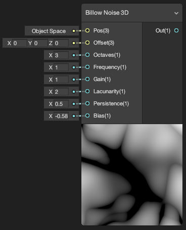
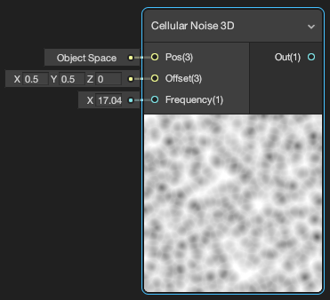
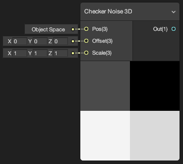
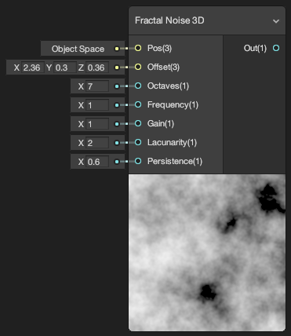
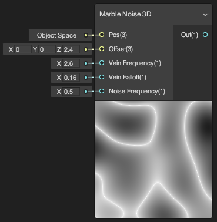
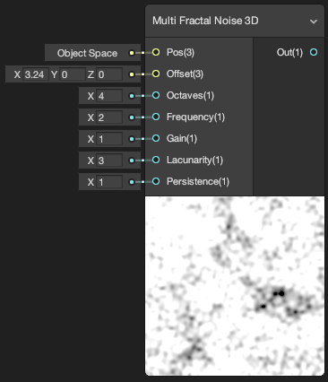
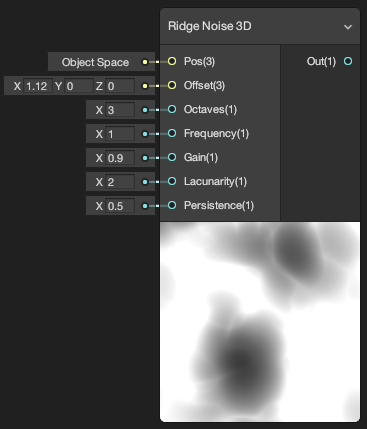
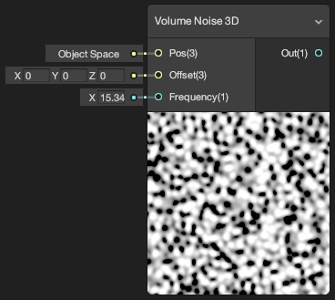
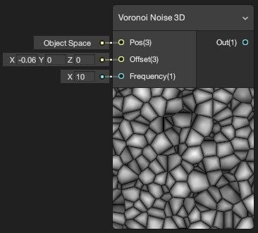
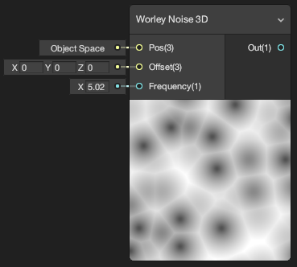

# shadergraphs
Shader Graphs for Unity

#3D Bars

#Billow Noise

#Cellular Noise

#Checker Noise

#Fractal Noise

#Marble Noise

#Multi Fractal Noise

#Ridge Noise

#Volume Noise

#Voronoi Noise

#Worley Noise

